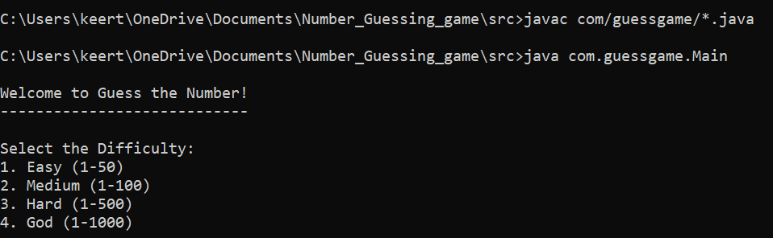
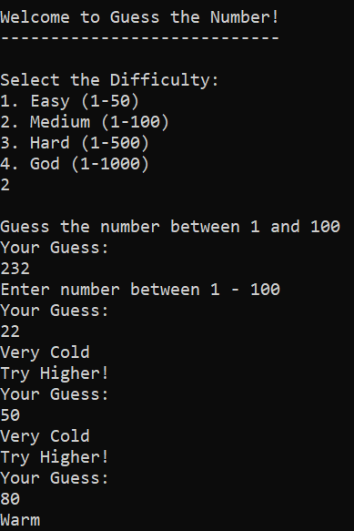
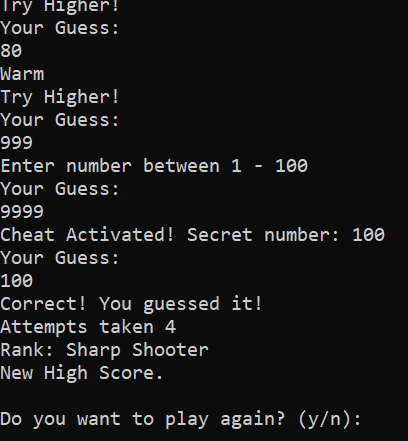

# GuessTheNumber --Java Console Game
Guess The Number is a console-based Java game where the player attempts to guess a randomly generated number within a specified range. The program provides hints after each guess, indicating whether the guessed number is too high or too low, helping the player reach the correct answer.

The project is designed using object-oriented programming principles and modular architecture. It separates responsibilities across different classes such as game logic, input handling, and score management to improve maintainability and readability.

# Features
1. Random Number Generation
The game generates a secret number randomly at the beginning of each game session. This ensures that every time the player starts a new game, the number to be guessed is different. The feature uses Java’s random number generation functionality, which adds unpredictability and makes the game more engaging for the player.

2. User Input Handling  
The program accepts guesses from the player through console input. A dedicated input handling system ensures that the player’s guesses are captured correctly and processed by the game logic. This feature helps maintain a smooth interaction between the player and the program.

3. Hint System (Higher / Lower Feedback)
After each guess, the game provides feedback to guide the player toward the correct answer. If the guessed number is smaller than the secret number, the game indicates that the correct number is higher. If the guess is larger, the game informs the player that the correct number is lower, helping the player refine their guesses.

4. Score Tracking System
The game keeps track of the number of attempts the player takes to guess the correct number. A scoring system evaluates player performance based on how efficiently they reach the correct answer. This feature adds a competitive element to the game and encourages players to improve their guessing strategy.

5. Game Control and Flow Management
The project includes a structured game flow that manages the start, execution, and completion of the game. The game continues running until the correct number is guessed or the game conditions are satisfied. This ensures that the gameplay experience is organized and easy for the player to follow.

6. Modular Class Design
The project is structured using multiple classes such as the main game controller, input handler, and score manager. Each class is responsible for a specific task, which improves code readability and maintainability. This modular approach follows object-oriented programming principles and makes the project easier to expand in the future.

7. Replayability
The game can be restarted after a round is completed, allowing players to play multiple sessions without restarting the entire program. This feature increases user engagement and gives players multiple opportunities to improve their scores. Replayability makes the project more interactive and user-friendly.

8. Cheat Code Feature
The game includes a hidden cheat code that allows the player to reveal the secret number during gameplay. When the player enters the specific cheat command instead of a number, the program displays the correct number for debugging or testing purposes. This feature is mainly useful for developers to verify game logic quickly without repeatedly guessing numbers.

# Tech Stack
# Java 
1. java.util.Random
The Random class from the java.util package is used to generate the secret number that the player must guess. It allows the program to create unpredictable numbers within a specified range. This ensures that each game session has a different target number, making the game more dynamic and engaging.

2. Methods for Game Operations
Custom methods are used to separate different responsibilities in the program, such as starting the game, checking guesses, or managing scores. This helps organize the code into smaller reusable blocks. Using methods improves readability and makes the program easier to maintain.

3. Object-Oriented Programming (Classes and Objects)
The project is built using multiple classes that represent different components of the game. Objects are created from these classes to manage input, scoring, and gameplay. This approach follows object-oriented design principles and helps keep the code structured and modular.

# Installation
1. Clone the git repository
    git clone https://github.com/BHARGAV-RUE/GuessTheNumber.git

2. Navigate to the project Folder
    cd GuessTheNumber

3. Compile java files
    javac com/guessgame/*.java

4. Run the java files
    java com.guessgame.Main

# Usage
1. Starting the Game
The user starts the game by running the program from the terminal or command prompt. Once the program begins, a welcome message and basic instructions are displayed on the console. The user is informed about the guessing range and how the game works.

2. Entering Guesses
The user interacts with the game by entering numbers through the console. Each input represents the player’s attempt to guess the secret number. The program reads the input using Java’s input handling system and processes the guess.

3. Receiving Feedback
After each guess, the game provides feedback to the player. If the guess is lower than the secret number, the program informs the player that the correct number is higher. If the guess is higher, the program tells the player to try a lower number.

4. Winning the Game
When the user correctly guesses the secret number, the game displays a success message. It also shows the number of attempts taken to guess the correct number. This helps the player evaluate their performance.

5. Using the Cheat Code
If the user enters the predefined cheat code(**9999**) instead of a number, the program reveals the secret number. This feature is mainly intended for testing or debugging purposes. It allows the player or developer to instantly see the correct answer.

6. Playing Again
After completing a round, the user may be given the option to start another game. This allows continuous gameplay without restarting the program. The system resets the secret number and attempt count for the new session.

# Screenshots

# Project Structure
GuessTheNumber/
│
├── README.md
│
├── img/
│   └── (images used in the project)
│
└── src/
    │
    ├── highscore.txt
    │
    ├── bin/
    │   └── com/
    │       └── guessgame/
    │           ├── Main.class
    │           ├── GuessGame.class
    │           ├── InputHandler.class
    │           └── ScoreManager.class
    │
    └── com/
        └── guessgame/
            ├── Main.java
            ├── GuessGame.java
            ├── InputHandler.java
            └── ScoreManager.java

# License

## Author
**Kallepally Bhargav**

- Information Technology student
- Java Developer
- GitHub: https://github.com/BHARGAV-RUE
- Linkedin: https://www.linkedin.com/in/bhargav-kallepally-816504241/